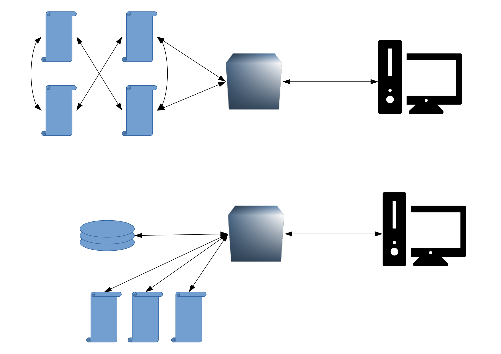
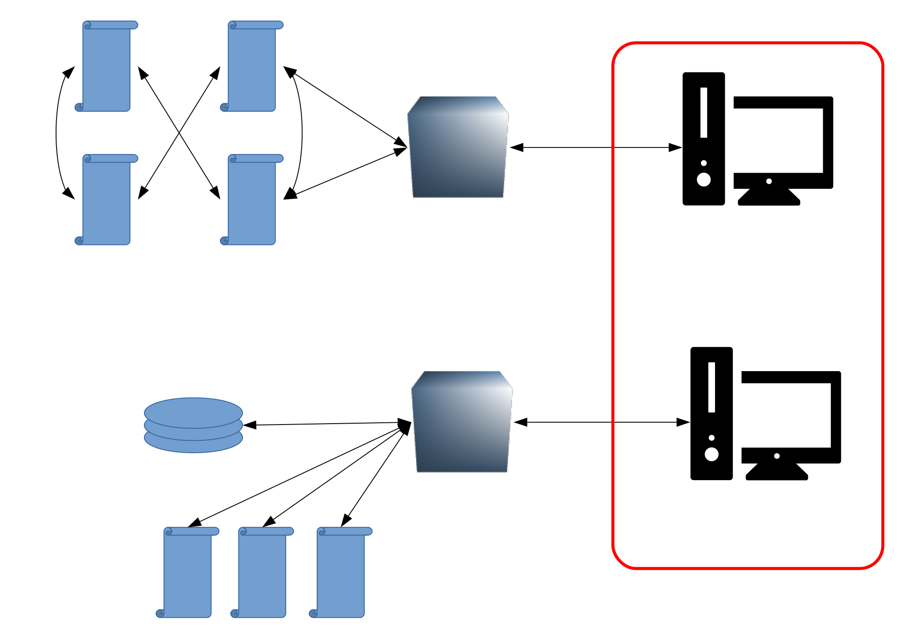

name: inverse
layout: true
class: center, middle, inverse
---
# Progetto COLLEZIONI-AMO

Per la creazione partecipata di un Museo scolastico - reale e virtuale, aperto al territorio - degli strumenti scientifici d’epoca, delle collezioni naturalistiche e delle macchine matematiche del Liceo Scientifico “A.Tassoni” di  Modena


.footnote[a cura di Parmiggiani Marco, Modena <br> Liceo Tassoni - 30/01/2019]

---

layout: false


## Prima, un po' di ripasso.....

--
#### Facciamo una prova

Google Chrome

--

[http://atom.io](http://atom.io)


---

## I computer sono (più) stupidi

Dal 1946 conoscono UNA SOLA lingua:

```
    01001000 10000011 11101100 00011000
    11000111 01000100 00100100 00000100
    00000001 00000000 00000000 00000000
    11000111 00000100 00100100 00000010
    ........
```

ed altre decine di migliaia di istruzioni eseguono la somma
$$ a = 1+2$$

--

Dati ed istruzioni sono in [**codice binario**](https://it.wikipedia.org/wiki/Sistema_numerico_binario).

---

## I linguaggi di programmazione...

... traducono istruzioni comprensibili per un essere umano,
$$ \text{ad es.}\ \ \ a = 1+2,$$

--
... in istruzioni comprensibili per un computer (smartphone/tablet etc.)

```
    01001000 10000011 11101100 00011000
    11000111 01000100 00100100 00000100
    00000001 00000000 00000000 00000000
    11000111 00000100 00100100 00000010
    ........
```
--
Esiste circa **un migliaio** di linguaggi di programmazione diversi.


---

## Il WWW

.whole-img[]

---


## Il WWW

.whole-img[]

---

## Il browser

--
Nella barra degli indirizzi si digita un URL (Uniform Resource Locator)
che specifica dove reperire il contenuto desiderato. Tipicamente `www...`.

--

**Ogni** contenuto accessibile in internet è identificato dal suo URL,
anche applicazioni, immagini, video etc..

--

Nello sviluppo di un sito internet occorre tenere conto che ciascun utente
può usare un browser diverso. Quindi tutto quello che si fa deve funzionare
su tutti i browser. **Non** si può e **non** si deve costringere un utente
ad usare un browser specifico.

---

## La "TRINITÀ"


--

Ciascuno di questi _linguaggi_ è "standardizzato" da organismi dei quali fanno parte i maggiori _stakeholder_ della rete (Apple, Google, Facebook etc.)

---

## La "TRINITÀ"

#### HTML (HyperText Markup Language)
Descrive, in maniera gerarchica, la *struttura* di una pagina web.

--

#### CSS (Cascading Style Sheets)
Specifica le regole che stabiliscono l'*aspetto* degli elementi
di una pagina web.

--

#### JS (Javascript/ECMAScript)
E' un vero e proprio linguaggio di programmazione che consente
di gestire l'interattività delle pagine web, nonché di alterare,
sulla base di eventi specifici, la struttura stessa della pagina.


--
Tutto ciò è scritto su semplici file di testo. Il file può essere unico ma
spesso conviene separarli (*divide et impera...*).


---
## HTML

Ogni file HTML deve iniziare con la *dichiarazione*

```html
<!DOCTYPE html>
```

che dice al browser che il documento che sta aprendo è un file HTML
(nella versione 5).

--

Concetto chiave di un documento HTML è il **tag**: una sequenza di
caratteri delimitati da `<` e `>` che specifica il tipo di *elemento* che
si vuole inserire.

Quasi tutti i tag vanno *aperti* e *chiusi*. Il contenuto dei tag va inserito
tra il tag di apertura e il tag di chiusura. Il tag di chiusura si distingue
per la presenza della `/`.

--
```html
<html>  </html>
```
--
Il un tag può contenere testo e/o altri tag.


---
## Struttura di base di un file HTML


.img_schema[]


---

## Un file HTML minimale


```html
<!DOCTYPE HTML>
<html>
    <head>
        <!-- qui ci vanno informazioni sulla pagina //-->
    </head>
    <body>
        <p>Ciao mondo!</p>
        <p>Questa è la mia prima pagina internet</p>
    </body>
</html>
```

L'*indentazione* consente ad un essere umano di visualizzare meglio
la struttura del documento.


---
## Volendo dare un titolo...

```html
 ...<head>
        <title>La mia fantastica pagina web</title>
    </head>...
```

---
## Per strutturare un documento

Da `<h1>` a `<h6>` si usano per dare il titolo ad una sezione
```html
 ...<body>
        <h1>Fonografo di Edison</h1>
        <h3>Funzionamento</h3>
        <p>Il fonografo non funziona</p>
        <h3>Materiali</h3>
        <p>Legno e ottone</p>
    </body>...
```
--
Per identificare una specifica porzione di testo si usa il tag `<span>`

```html
     ...<h3>Funzionamento</h3>
        <p>Il fonografo <span>non</span> funziona</p>
        <h3>Materiali</h3>...
```
vedremo tra un attimo perché...


---
## Per strutturare un documento

#### Interruzioni
* `<br>` forza una interruzione della riga
* `<hr>` inserisce un elemento separatore orizzontale

```html
 ...<body>
        <h1>Fonografo di Edison</h1>
        <h3>Funzionamento</h3>
        <p>Il fonografo <br> <span>non</span> funziona</p>
        <hr>
        <h3>Materiali</h3>
        <p>Legno e ottone</p>
    </body>...
```
---
## Gli attributi

Ogni tag _può_ avere degli __attributi__, cioè delle sequenze di caratteri
che specificano alcune informazioni su quel tag.

Gli attributi hanno sempre la forma `attributo="valore"`.

--

Alcuni attributi regolano l'aspetto degli elementi di una pagina:
```html
 ...<p>Il fonografo <br> <span style="color:red">non</span> funziona</p>
        <hr>
        <h3>Materiali</h3>
        <p>Legno e ottone</p>
    </body>...
```

---
## Gli attributi

Due attributi molto importanti sono `id` e `class`:
il primo serve ad identificare in maniera _univoca_ un elemento:
```html
        ...<p id="materiali">Legno e ottone</p>...
```

--

`class` si usa per identificare tutti gli elementi che condividono una
certa funzione o un certo aspetto:
```html
     ...<h3 class="sezione-importante">Materiali</h3>
        <p>Legno e ottone</p>
        <h3 class="sezione-importante">Risorse Esterne</h3>
```

--
vedremo a breve a cosa servono

---
## Collegamenti esterni

Gli attributi si usano per creare i collegamenti ad altre pagine (i *link*):

```html
 ...<p>Legno e ottone</p>
    <h3 class="sezione-importante">Risorse esterne</h3>
    <p><a href="https://it.wikipedia.org/wiki/Fonografo">Wikipedia</a></p>...
```

`a` sta per _anchor_.

---
## Immagini

Anche le immagini richiedono attributi per la specifica della risorsa da
reperire

```html
 ...<p><a href="https://it.wikipedia.org/wiki/Fonografo">Wikipedia</a></p>
     <h3>Immagini</h3>
     
     <br>
     <p id="caption">Questo è il logo dell'azienda Google</p>...
```

Notare che il tag `` __non__ richiede un tag di chiusura.

### Bottoni
```html
 ...<p><a href="https://it.wikipedia.org/wiki/Fonografo">Wikipedia</a></p>
     <h3>Immagini</h3>
     
     <br>
     <p id="caption">Questo è il logo dell'azienda Google</p>
     <button> Modifica! </button>...
```
---
## Posizionamento di elementi nella pagina

Il primo passo è l'introduzione di un tag particolare, che viene utilizzato per
identificare porzioni di documento:

```html
  ...<div id="immagini">
         <h3>Immagini</h3>
         
         <br>
         <p id="caption">Questo è il logo dell'azienda Google</p>
         <button>Modifica!</button>
     </div>...
```

vedremo in seguito come fare a posizionare gli elementi.

---

## CSS (cascading style sheets)

Le istruzioni CSS regolano l'aspetto ed il posizionamento degli elementi nella
pagina. Una prima istruzione l'abbiamo già vista:

```html
    ...<p>Il fonografo <br> <span style="color:red">non</span> funziona</p>...
```

Tipicamente è una cattiva pratica inserire istruzioni di stile in ogni
singolo tag. Questo perché chiaramente, se abbiamo 100 tag colorati di rosso
che vogliamo colorare di blu, sarà necessario andare a modificare tutti e
100 i tag.

Conviene invece che le istruzioni di stile siano poche, in modo che se vogliamo
cambiare l'aspetto della pagina basta modificare una istruzione sola.

--

Quindi... cancelliamo l'attributo `style` nel tag `span` (mi raccomando,
cancellate sia l'attributo sia il suo valore).

---

## Posizionamento delle istruzioni di stile

Le istruzioni di stile possono essere date in due modi:
* all'interno di ciascun file HTML, all'interno di un tag `style`
* in un file `.css` separato

--

Per ora vediamo solo il primo caso....


```html
 ...<head>
        <title>La mia fantastica pagina web</title>
        <style>
        </style>
    </head>...
```


---

## Le istruzioni CSS

Le istruzioni hanno tutte lo stesso formato:

```
identificativo-elemento {
    proprietà : valore;
}
```

--

nel caso di prima, volendo colorare di rosso un elemento `span`,

```html
    <style>
        span {
            color : red;
        }
    </style>
```

--

se adesso aggiungiamo un altro elemento `span` alla pagina,
esso verrà correttamente colorato di rosso

```html
  ...<div id="immagini">
         <h3>Immagini</h3>
         
         <p>Questo è il logo dell'azienda <span>Google</span></p>
     </div>...
```
---

## Selezione di elementi specifici

Se intendiamo modificare l'aspetto di un solo elemento specifico, non
possiamo usare il tag come identificativo, perché in quel modo verrebbero
modificati tutti gli elementi con quel tag.

--

Ad esempio, se vogliamo che la
sezione materiali sia sottolineata, una regola del tipo

```css
    p {
        text-decoration: underline;
    }
```
non funziona (provare per credere...)

--

Gli attributi `id` e `class` servono esattamente a questo (e a molto altro).


```css
    #materiali {
        text-decoration: underline;
    }
```
Il simbolo `#` serve a selezionare un `id` specifico (ricordate che avevamo
scritto `<p id="materiali">`.)


---

## Selezione di elementi specifici

se vogliamo modificare tutti gli elementi appartenenti alla stessa
classe si usa il punto `.`.

```css
    .sezione-importante {
        text-shadow: 3px 2px blue;
    }
```

---
## Posizionamento di elementi
Se vogliamo posizionare in maniera diversa un elemento dobbiamo
specificare più di una proprietà

```css
    #immagini {
        position : relative;
        left : 100px;
    }
```
in questo modo l'elemento viene spostato di 100 pixel a destra
rispetto a dove si troverebbe di solito (`left` specifica la
dimensione del margine sinistro).

---

## Javascript/ECMAScript

Il linguaggio di programmazione ES, insieme alle sue varianti, consente
di aggiungere interattività di base alla pagina. Anche in questo caso,
è possibile inserire le istruzioni
* all'interno di ciascun file HTML, all'interno di un tag `script`
* in un file `.js` separato

--

al solito, noi optiamo per la prima opzione.

Ricordatevi di mettere il tag `script` all'interno del `body`, ma
_sempre come ultimo elemento_.

---
## Due parole sul linguaggio....

Per questa prima fase, invece di inserire i comandi nella pagina,
proviamo qualche comando.

.linkbig[[jsconsole.com](jsconsole.com)]

--

In questo sito possiamo inserire delle istruzioni, che vengono
eseguite da un _interprete_ ES, il quale a sua volta ci restituisce il
risultato

```js
> 2+3;
> 15-3;
> 78*14;
> /* questo è un commento */
```

--

ogni comando dovrebbe terminare con il '`;`', ma se ve lo dimenticate
tipicamente non succede nulla.

---

## Variabili

.left_col_3_4[

]
.right_col_1_4[

]

---

## Variabili

.left_col_3_4[
<br><br><br><br>
```js
> var a = 4;
```
]
.right_col_1_4[

]

---

## Variabili

.left_col_3_4[
<br><br><br><br>
```js
> var a = 4;
```
```js
> a;
```
]
.right_col_1_4[

]

---

## Variabili

adesso `a` ha un valore ben definito. Possiamo usare direttamente
il nome della variabile per fare dei conti
```js
> a + 10;
> a * 90;
```

---
## Nomi di variabili


Se si vuole dare un "significato" ad una variabile, si possono usare due sistemi:

```js
variabile_molto_importante = 42
variabileMoltoImportante = 38
```

--
ES è *case-sensitive*:
```js
> a = 3
> var A = 6
> a
```

--
non tutti i nomi vanno bene..

.linkbig[[Reserved words](https://www.w3schools.com/js/js_reserved.asp)]


---
## Fuzioni
 .img_schema[]


--

 .img_schema[]


---
## Funzioni

In ES, una funzione va prima definita poi si può utilizzare.
La sintassi per una funzione senza argomenti è

```js
> function ciao() {             /* premere shift+enter per andare a capo */
    console.log("Ciao mondo");  /* premere shift+enter per andare a capo */
}   
```
`console.log` altro non è che una funzione speciale che l'interprete
conosce già.

--
La funzione va poi _chiamata_, cioè eseguita:
```js
> ciao();
```

--
N.B.: abbiamo usato le virgolette per stampare una sequenza di
caratteri. L'interprete ha bisogno di sapere che "Ciao mondo"
sono caratteri da stampare (_stringhe_) e non variabili!

---

## Funzioni e argomenti
Le funzioni sono utili quando il loro comportamento dipende dagli
argomenti (vedi schema precedente). Per inserire gli argomenti
si usa

```js
> function ciao2(nome) {          /* shift+enter */
    console.log("Ciao " + nome);  /* shift+enter */
}
```
si usa il `+` per _concatenare_ le stringhe.

--
a questo punto la funzione si aspetta un argomento (`nome`) che
va fornito ogni volta che essa viene chiamata.


```js
> ciao2("Mario");
> ciao2("Chiara");
```

--
provare cosa succede se:
* chiamiamo la prima funzione con un argomento (`ciao("Mario")`)
* chiamiamo la seconda senza argomento (`ciao2()`)
* chiamiamo la seconda dando un numero come argomento.


---

## Torniamo al nostro documento

```html
        <script>

            console.log("Ciao mondo");

        </script>
    </body>
</html>
```

Il risultato non è visibile, perché nessuno (per fortuna) deve
interagire con una console.

Potete però vedere il risultato premendo `Ctrl+Shift+I`, cliccando
su `console` e ricaricando la pagina.

---

## Interattività di base

Per gestire l'interattività è fondamentale il concetto di _funzione_,
per eseguire determinate funzioni _solo_ quando vi è un input da
parte dell'utente.

Per fare questo, definiamo prima la funzione
```html
        <script>

            var caption = document.getElementById("caption");

            function modifica() {
                caption.innerHTML="Questo è il logo di oggi.";
            }

        </script>
```

--

Poi modifichiamo il bottone con un apposito attributo:
```html
<button onclick="modifica()">Modifica!</button>
```

La pagina ora dovrebbe venire modificata quando clicchiamo sul bottone.

---

## Risorse esterne

#### In italiano
[www.html.it](www.html.it)


#### In inglese
[w3schools.com](www.w3schools.com)
